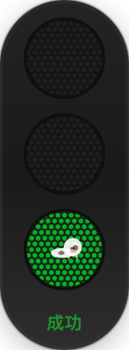
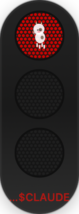

# CodeLight — AI 编程助手红绿灯

一个 macOS 菜单栏小工具，用仿真交通信号灯实时显示 AI 编程助手（Claude Code / Codex / Cursor）的工作状态。

红灯亮起说明正在执行，绿灯亮了说明任务完成 — 一眼就能看出 AI 干活干到哪了。

## 状态说明

| 灯效 | 状态 | 含义 |
|------|------|------|
| 🟢 绿灯常亮 | 空闲 | 任务完成，当前无操作 |
| 🟡 黄灯呼吸 | 思考中 | AI 正在读代码、分析逻辑 |
| 🔴 红灯快闪 | 执行中 | AI 正在调用工具（Bash/Read/Edit 等） |
| 🔴 红灯慢闪 | 报错 | 会话异常终止 |
| 🟡 黄灯闪烁 | 修复中 | 工具调用失败，正在重试 |

## 截图

<p align="center">
  
  
</p>


## 快速开始

### 1. 启动 Python 服务

```bash
pip install flask
python light-server.py
```

服务默认运行在 `http://localhost:8866`，可通过环境变量修改端口：

```bash
CODELIGHT_PORT=9000 python light-server.py
```

### 2. 启动 macOS App

双击 `CodeLight.app`，或在 Xcode 中直接编译运行 `CodeLight.swift`。

App 会在菜单栏显示一个迷你红绿灯图标，并在屏幕右上角弹出悬浮灯窗口。

### 3. 配置 Hook

打开 App 设置，切换到「配置 Hook」选项卡，勾选你要支持的工具（Claude Code / Codex / Cursor），点击「应用配置」即可一键写入。

也可以手动配置：

**Claude Code** — `~/.claude/settings.json`

```json
{
  "hooks": {
    "PreToolUse": [
      {
        "matcher": "",
        "hooks": [
          {
            "type": "command",
            "command": "curl -s -X POST http://127.0.0.1:8866/api/state -H 'Content-Type: application/json' -d '{\"state\": \"working\", \"message\": \"executing $CLAUDE_TOOL_NAME\", \"session_id\": \"$CLAUDE_SESSION_ID\"}'"
          }
        ]
      }
    ],
    "PostToolUse": [
      {
        "matcher": "",
        "hooks": [
          {
            "type": "command",
            "command": "curl -s -X POST http://127.0.0.1:8866/api/state -H 'Content-Type: application/json' -d '{\"state\": \"thinking\", \"message\": \"analyzing\", \"session_id\": \"$CLAUDE_SESSION_ID\"}'"
          }
        ]
      }
    ],
    "Stop": [
      {
        "matcher": "",
        "hooks": [
          {
            "type": "command",
            "command": "curl -s -X POST http://127.0.0.1:8866/api/state -H 'Content-Type: application/json' -d '{\"state\": \"idle\", \"message\": \"done\", \"session_id\": \"$CLAUDE_SESSION_ID\"}'"
          }
        ]
      }
    ]
  }
}
```

**Codex** — `~/.codex/config.json`

```json
{
  "hooks": {
    "PreToolUse": [
      {
        "matcher": "",
        "hooks": [
          {
            "type": "command",
            "command": "curl -s -X POST http://127.0.0.1:8866/api/state -H 'Content-Type: application/json' -d '{\"state\": \"working\", \"message\": \"executing\", \"session_id\": \"codex\"}'"
          }
        ]
      }
    ],
    "PostToolUse": [
      {
        "matcher": "",
        "hooks": [
          {
            "type": "command",
            "command": "curl -s -X POST http://127.0.0.1:8866/api/state -H 'Content-Type: application/json' -d '{\"state\": \"thinking\", \"message\": \"analyzing\", \"session_id\": \"codex\"}'"
          }
        ]
      }
    ],
    "Stop": [
      {
        "matcher": "",
        "hooks": [
          {
            "type": "command",
            "command": "curl -s -X POST http://127.0.0.1:8866/api/state -H 'Content-Type: application/json' -d '{\"state\": \"idle\", \"message\": \"done\", \"session_id\": \"codex\"}'"
          }
        ]
      }
    ]
  }
}
```

**Cursor** — `~/.cursor/settings.json`

```json
{
  "hooks": {
    "PreToolUse": [
      {
        "matcher": "",
        "hooks": [
          {
            "type": "command",
            "command": "curl -s -X POST http://127.0.0.1:8866/api/state -H 'Content-Type: application/json' -d '{\"state\": \"working\", \"message\": \"executing $CURSOR_TOOL_NAME\", \"session_id\": \"$CURSOR_SESSION_ID\"}'"
          }
        ]
      }
    ],
    "PostToolUse": [
      {
        "matcher": "",
        "hooks": [
          {
            "type": "command",
            "command": "curl -s -X POST http://127.0.0.1:8866/api/state -H 'Content-Type: application/json' -d '{\"state\": \"thinking\", \"message\": \"analyzing\", \"session_id\": \"$CURSOR_SESSION_ID\"}'"
          }
        ]
      }
    ],
    "Stop": [
      {
        "matcher": "",
        "hooks": [
          {
            "type": "command",
            "command": "curl -s -X POST http://127.0.0.1:8866/api/state -H 'Content-Type: application/json' -d '{\"state\": \"idle\", \"message\": \"done\", \"session_id\": \"$CURSOR_SESSION_ID\"}'"
          }
        ]
      }
    ]
  }
}
```

配置完成后，AI 助手开始工作、完成工作、或停下来思考时，红绿灯会自动切换。

## 功能特性

- **仿真交通灯** — LED 点阵灯珠 + 金属拉丝外壳，不是简单的色块
- **灯上吉祥物** — 小牛在不同状态有不同动画：躺平休息、耕地、思考、修 bug、倒地晕倒
- **多会话支持** — 同时开多个 Claude Code 窗口，自动聚合显示最严重的状态
- **菜单栏图标** — 状态栏迷你红绿灯，一眼看到全局状态
- **悬浮窗口** — 可拖拽、可调整大小，支持全屏应用上层显示
- **跑马灯文字** — 状态文字过长时自动滚动显示
- **任务完成通知** — 所有会话空闲时弹出 macOS 原生通知
- **横向/纵向切换** — 设置中可切换灯的方向

## API 接口

### GET /api/state

获取当前聚合状态。

```json
{
  "state": "working",
  "message": "executing Bash",
  "light": {"red": 1, "yellow": 0, "green": 0, "label": "执行中", "css": "#D90000", "blink": true},
  "sessions": {},
  "active_count": 1
}
```

### POST /api/state

上报状态。

```json
{
  "state": "working",
  "message": "executing Bash",
  "session_id": "abc123"
}
```

支持的状态值：`idle`、`thinking`、`working`、`fixing`、`error`

### GET /api/sessions

查看所有活跃会话。

### GET /api/history

查看最近 100 条状态变更记录。

### DELETE /api/session/:id

手动清理某个会话。

## 设置项

在 App 菜单中点击「设置」可配置：

| 设置项 | 说明 | 默认值 |
|--------|------|--------|
| 服务端口 | Python 服务的端口号 | 8866 |
| 轮询间隔 | 查询状态的时间间隔 | 0.5s |
| 透明度 | 灯窗口的透明度 | 100% |
| 闪烁速度 | 闪烁动画的周期 | 0.6s |
| 窗口大小 | 灯珠的基础尺寸 | 40 |
| 横向排列 | 红绿灯横向/纵向排列 | 纵向 |
| 状态文字 | 底部是否显示状态文字 | 显示 |
| 开机自启 | 登录时自动启动 | 关闭 |
| Dock 图标 | 是否在 Dock 栏显示 | 关闭 |
| 完成通知 | 任务完成时弹通知 | 开启 |
| 全屏上层 | 全屏应用时也显示 | 开启 |

## 项目结构

```
.
├── light-server.py      # Python Flask 状态服务
├── CodeLight.swift      # macOS App 完整源码（单文件）
├── CodeLight.app/       # macOS 应用（可直接运行）
└── images/              # 截图

## 系统要求

- macOS 13.0+
- Python 3.8+
- Flask

## License

MIT
