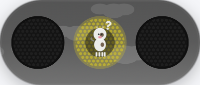
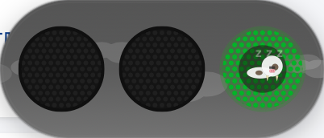
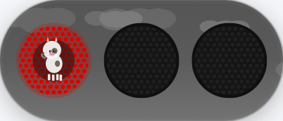
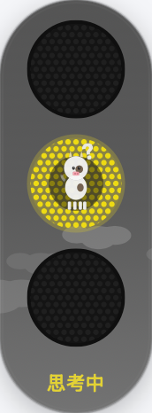
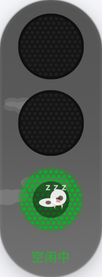
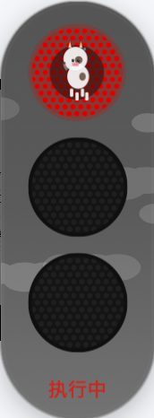

# CodeLight — AI 编程助手红绿灯

**[English](./README_EN.md)** | 简体中文 | [繁體中文](./README_EN.md#繁體中文)

<p>
  <a href="https://github.com/guandeng/code-light/releases/latest">
    
  </a>
  <a href="https://github.com/guandeng/code-light/releases">
    
  </a>
  
  
</p>

一个 macOS 菜单栏小工具，用仿真交通信号灯实时显示 AI 编程助手（Claude Code / Codex / Cursor）的工作状态。

红灯亮起说明正在执行，绿灯亮了说明任务完成 — 一眼就能看出 AI 干活干到哪了。

## ✨ 功能特性

### 🚦 实时状态灯

| 灯效 | 状态 | 含义 |
|------|------|------|
| 🟢 绿灯常亮 | 空闲 | 任务完成，当前无操作 |
| 🟡 黄灯呼吸 | 思考中 | AI 正在读代码、分析逻辑 |
| 🔴 红灯快闪 | 执行中 | AI 正在调用工具（Bash/Read/Edit 等） |
| 🔴 红灯慢闪 | 报错 | 会话异常终止 |
| 🟡 黄灯闪烁 | 修复中 | 工具调用失败，正在重试 |
| 🔴 红灯快闪 | 等待授权 | 等待用户批准权限请求 |

### 🎨 四种显示模式

| 模式 | 说明 |
|------|------|
| 竖版 | 经典竖向三灯，紧凑小巧 |
| 横版 | 横向三灯排列，适合窄空间 |
| 迷你 | 单色圆点，极简模式 |
| 磁吸边栏 | 10px 薄条，自动吸附屏幕左/右边缘 |

- 拖动到屏幕边缘自动吸附，拖离恢复
- 双击切换显示模式，窗口位置记忆
- 支持透明度、大小、闪烁速度自定义

### 🐄 五种吉祥物

牛、猫、机器人、马、小鸡 — 每种吉祥物都有独立的状态动画（走路、打盹、挥锤、晕倒等）。支持自定义吉祥物图片。

### 🌤️ 天气主题

开启后灯窗口背景呈现实时天气动画：晴天、多云、雨天、雪天、雷暴，自动根据城市和时间切换日夜效果。支持 20 个中国城市。

### 🔔 权限气泡

AI 请求权限时弹出微信风格聊天气泡，显示工具名和命令详情，提供允许/拒绝按钮。支持三种模式：

| 模式 | 行为 |
|------|------|
| 🔔 弹窗确认 | 所有请求弹气泡，手动处理（默认） |
| 🚀 总是运行 | 所有请求自动通过 |
| 📋 规则运行 | 匹配规则自动通过，其余弹窗 |

### 📊 工作统计

- **今日概览**：使用时长、工具调用次数、会话数
- **状态分布图**：思考/执行/空闲时长占比
- **周趋势图**：7 天每日活跃时间
- **高频工具 Top 5**：最常用工具排行
- **今日时间线**：24 小时彩色时间轴，直观展示工作节奏
- 数据本地存储，保留 30 天自动清理

### 🧩 技能管理

- **已安装**：扫描本地 `~/.claude/skills/`、`~/.claude/commands/` 下的技能
- **发现**：从 GitHub Marketplace（Anthropic / Vercel / Microsoft Azure）浏览安装
- 支持 Git 克隆、本地目录导入、Zip 包导入
- 一键安装/卸载，标签筛选

### 🔄 WebDAV 同步

通过 WebDAV（坚果云等）跨设备同步配置，支持自动同步。

### ⬆️ 自动更新

支持自动检查更新（GitHub Releases API），有新版本时弹窗提示，一键前往下载。

### 🌐 多语言（中/繁/英）

设置面板支持**简体中文 / 繁體中文 / English** 三种语言，实时切换无需重启。

**切换方法**：
1. 右键状态栏红绿灯 → 设置（或菜单栏 CodeLight → 偏好设置）
2. 进入「⚙️ 通用」标签页
3. 顶部「界面语言」下拉选择：
   - **跟随系统** — 自动匹配 macOS 系统语言（简体/繁体/英文）
   - **简体中文** / **繁體中文** / **English** — 手动指定
4. 选择后界面立即切换生效

> 灯效状态名（空闲/思考/执行…）、菜单、字段标题、统计页等均已国际化。

### ⌨️ 快捷键

| 快捷键 | 功能 |
|--------|------|
| `⌘⇧F15` | 显示/隐藏灯窗口 |
| `⌘⇧F14` | 切换显示模式 |
| `⌘,` | 打开设置 |
| `⌘T` | 切换窗口可见性 |
| `⌘D` | 切换显示模式 |
| `⌘L` | 打开今日时间线 |
| `⌘R` | 重置窗口位置 |
| `⌘U` | 检查更新 |

### 🖥️ CLI 工具

```bash
codelight            # 查看当前状态
codelight sessions   # 列出所有会话
codelight history    # 查看最近状态变更
codelight watch      # 持续监控（1s 刷新）
```

## 📸 截图

<p align="center">
  
  
  
</p>
<p align="center">
  
  
  
</p>

## 🚀 快速开始

[**⬇️ 下载最新版**](https://github.com/guandeng/code-light/releases/latest)（macOS 13.0+，Universal Binary 支持 Apple Silicon + Intel）

双击 `CodeLight.app` 即可运行。若提示"已损坏"，在终端执行：

```bash
xattr -cr CodeLight.app
```

打开 App 设置，切换到「配置 Hook」选项卡，勾选你要支持的工具（Claude Code / Codex / Cursor），点击「应用配置」即可一键写入。

也可以手动配置：

**Claude Code** — `~/.claude/settings.json`

```json
{
  "hooks": {
    "PreToolUse": [
      {
        "matcher": "",
        "hooks": [
          {
            "type": "command",
            "command": "curl -s -X POST http://127.0.0.1:8866/api/state -H 'Content-Type: application/json' -d '{\"state\": \"working\", \"message\": \"executing $CLAUDE_TOOL_NAME\", \"session_id\": \"$CLAUDE_SESSION_ID\"}' || echo '{}'"
          }
        ]
      }
    ],
    "PostToolUse": [
      {
        "matcher": "",
        "hooks": [
          {
            "type": "command",
            "command": "curl -s -X POST http://127.0.0.1:8866/api/state -H 'Content-Type: application/json' -d '{\"state\": \"thinking\", \"message\": \"analyzing\", \"session_id\": \"$CLAUDE_SESSION_ID\"}' || echo '{}'"
          }
        ]
      }
    ],
    "Stop": [
      {
        "matcher": "",
        "hooks": [
          {
            "type": "command",
            "command": "curl -s -X POST http://127.0.0.1:8866/api/state -H 'Content-Type: application/json' -d '{\"state\": \"idle\", \"message\": \"done\", \"session_id\": \"$CLAUDE_SESSION_ID\"}' || echo '{}'"
          }
        ]
      }
    ]
  }
}
```

**Codex** — 两步配置：

1. `~/.codex/config.toml` 启用 hooks：
```toml
[features]
hooks = true
```

2. `~/.codex/hooks.json` 配置 hook（格式与 Claude Code 一致）：
```json
{
  "hooks": {
    "PreToolUse": [
      {
        "matcher": "",
        "hooks": [
          {
            "type": "command",
            "command": "curl -s -X POST http://127.0.0.1:8866/api/state -H 'Content-Type: application/json' -d '{\"state\": \"working\", \"message\": \"executing\", \"session_id\": \"codex\"}' || echo '{}'"
          }
        ]
      }
    ],
    "PostToolUse": [
      {
        "matcher": "",
        "hooks": [
          {
            "type": "command",
            "command": "curl -s -X POST http://127.0.0.1:8866/api/state -H 'Content-Type: application/json' -d '{\"state\": \"thinking\", \"message\": \"analyzing\", \"session_id\": \"codex\"}' || echo '{}'"
          }
        ]
      }
    ],
    "Stop": [
      {
        "matcher": "",
        "hooks": [
          {
            "type": "command",
            "command": "curl -s -X POST http://127.0.0.1:8866/api/state -H 'Content-Type: application/json' -d '{\"state\": \"idle\", \"message\": \"done\", \"session_id\": \"codex\"}' || echo '{}'"
          }
        ]
      }
    ]
  }
}
```

**Cursor** — `~/.cursor/settings.json`

```json
{
  "hooks": {
    "PreToolUse": [
      {
        "matcher": "",
        "hooks": [
          {
            "type": "command",
            "command": "curl -s -X POST http://127.0.0.1:8866/api/state -H 'Content-Type: application/json' -d '{\"state\": \"working\", \"message\": \"executing $CURSOR_TOOL_NAME\", \"session_id\": \"$CURSOR_SESSION_ID\"}' || echo '{}'"
          }
        ]
      }
    ],
    "PostToolUse": [
      {
        "matcher": "",
        "hooks": [
          {
            "type": "command",
            "command": "curl -s -X POST http://127.0.0.1:8866/api/state -H 'Content-Type: application/json' -d '{\"state\": \"thinking\", \"message\": \"analyzing\", \"session_id\": \"$CURSOR_SESSION_ID\"}' || echo '{}'"
          }
        ]
      }
    ],
    "Stop": [
      {
        "matcher": "",
        "hooks": [
          {
            "type": "command",
            "command": "curl -s -X POST http://127.0.0.1:8866/api/state -H 'Content-Type: application/json' -d '{\"state\": \"idle\", \"message\": \"done\", \"session_id\": \"$CURSOR_SESSION_ID\"}' || echo '{}'"
          }
        ]
      }
    ]
  }
}
```

配置完成后，AI 助手开始工作、完成工作、或停下来思考时，红绿灯会自动切换。

## License

MIT
